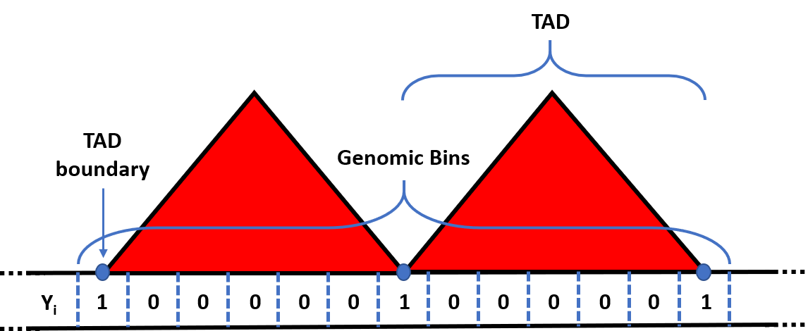
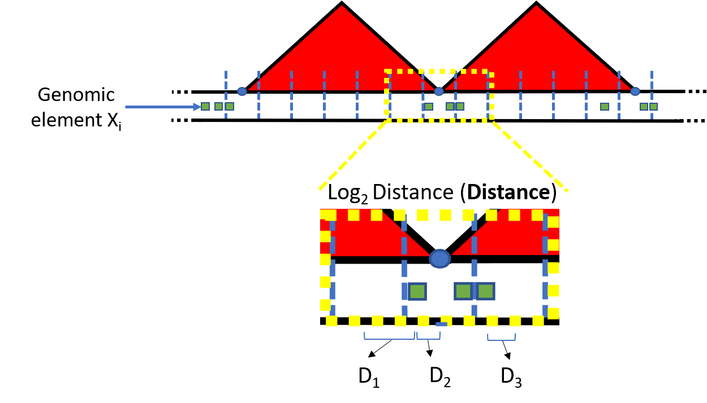
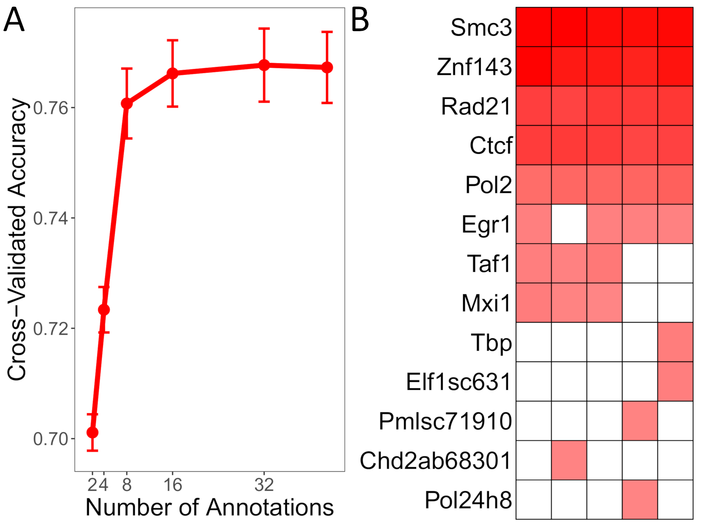
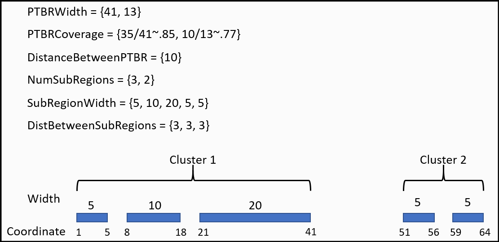

```{r setup, echo=FALSE, message=FALSE, warning=FALSE, include=FALSE}
# Set up the environment
knitr::opts_chunk$set(echo=T, warnings=F, message=F,
  collapse = TRUE,
  comment = "#>"
)
set.seed(1)
options(stringsAsFactors = FALSE)
```

# Installation

```{r}
library(devtools)
library(knitr)
library(ggplot2)
library(ExperimentHub)

# if (!requireNamespace("BiocManager", quietly=TRUE))
#     install.packages("BiocManager")
# BiocManager::install("preciseTAD")
#library(preciseTAD)

#devtools::install_github("dozmorovlab/preciseTAD")
library(preciseTAD)

#install_github("stilianoudakis/preciseTADhub")
#library(preciseTADhub)
```

# Introduction

The advent of chromosome conformation capture (3C) sequencing technologies, and its successor Hi-C, have revealed a hierarchy of the 3-dimensional (3D) structure of the human genome such as chromatin loops [@rao20143d], Topologically Associating Domains (TADs) [@nora2012spatial;@dixon2012topological], and A/B compartments [@lieberman2009comprehensive]. At the megabase scale, TADs represent regions on the linear genome that are highly self-interacting. Emerging evidence has linked TADs to critical roles in cell dynamics and cell differentiation. Studies have shown that TADs themselves are highly conserved across species and cell lines [@dixon2012topological; @krefting2018evolutionary; @nora2012spatial; @dixon2015chromatin; @rao20143d; @Schmitt2016aa]. Disruption of boundaries demarcating TADs and loops promotes cancer [@hnisz2016activation; @taberlay2016three] and other disorders [@lupianez2016breaking;@Sun:2018aa;@Meaburn:2007aa]. Therefore, identifying the precise location of TAD boundaries remains a top priority in our goal to fully understand the functionality of the human genome.

In this workshop, we present *preciseTAD*, an optimally tuned machine learning framework for precise identification of domain boundaries using genome annotation data. Our method utilizes the random forest (RF) algorithm trained on high-resolution chromatin state (BroadHMM), histone modification (HM), and transcription factor binding site (TFBS) data to predict low-resolution boundaries. We introduce a systematic pipeline for building the optimal boundary region prediction classifier. Translated from Hi-C data resolution level to base level (annotating each base and predicting its boundary probability), *preciseTAD* employs density-based clustering (DBSCAN) and partitioning around medoids (PAM) to detect genome annotation-guided boundary regions and points at a base-level resolution. This approach circumvents resolution restrictions of Hi-C data, allowing for the precise detection of biologically meaningful boundaries.

In this workshop we will demonstrate the following:

<!--
- Spatial associations (linear distance) between boundaries and annotations perform best for predicting boundary regions
- Simple random under-sampling effectively addresses the negative effect of class imbalance
-->
- *preciseTAD* predictions are more enriched for known molecular drivers of 3D chromatin, including CTCF, RAD21, SMC3, and ZNF143
- *preciseTAD*-predicted boundaries are more conserved across cell lines
- Using the methods developed, a model trained in one cell line can predict boundaries in another cell line

# Obtaining ground truth TAD boundaries

*preciseTAD* uses pre-defined TAD boundary coordinates as ground truth. We opt to use the Arrowhead algorithm to define our ground truth TAD boundaries, a gold-standard TAD-caller developed by [Aiden Lab](https://github.com/aidenlab/juicer/wiki/Citing-Juicer) [@durand2016juicer]. The .hic files are publically available on GEO [here](), and are provided by the same team that developed Arrowhead [@rao20143d]. For the *preciseTAD* paper and this workshop we will be working with the "GSE63525_GM12878_insitu_primary.hic" file. This .hic file is a highly compressed binary file that has contact matrices from multiple biological replicate HiC experiments, at different resolutions, for GM12878. You can read the full protocol used to derive the various .hic files [here](https://www.cell.com/cell/pdfExtended/S0092-8674(14)01497-4).

Once you have the .hic file downloaded, you are ready to implement Arrowhead to call TAD boundaries. Below is an example of how you would perform this for every chromosome and for a variety of resolutions:

```{bash, eval=FALSE}
for i in 5000 10000 25000 50000 100000;
	do 
		echo $i.kb
			for j in {1..22};
				do
				echo chr$j
				java -jar juicebox_tools_7.5.jar arrowhead -c $j \ #chromosome to call TADs on
				                                           -r $i \ #HiC data resolution
				                                           ~/GSE63525_GM12878_insitu_primary.hic \ #location of the .HIC file
				                                           ~/arrowhead_output/GM12878/$i.b/chr$j #location to store the output
			done;
	done;
	
```

Note: This creates separate files for each chromosome (given a specific resolution). As an example, here is what the first few lines of CHR1 look like, performed at 5kb:

| chr1 | x1        | x2        | chr2 | y1        | y2        | color     | score               | uVarScore           | lVarScore           | upSign             | loSign              |
|------|-----------|-----------|------|-----------|-----------|-----------|---------------------|---------------------|---------------------|--------------------|---------------------|
| 1    | 49375000  | 50805000  | 1    | 49375000  | 50805000  | 255,255,0 | 0.8635365988485998  | 0.3025175910115416  | 0.2942087461534729  | 0.4431332556332556 | 0.6401515151515151  |
| 1    | 16830000  | 17230000  | 1    | 16830000  | 17230000  | 255,255,0 | 0.20513320424507786 | 0.3676005813255187  | 0.22358121923097696 | 0.4121951219512195 | 0.4792682926829268  |
| 1    | 163355000 | 164860000 | 1    | 163355000 | 164860000 | 255,255,0 | 0.8052794339967723  | 0.27908025641958345 | 0.3017420763866275  | 0.657032586290075  | 0.5470812683654226  |
| 1    | 231935000 | 233400000 | 1    | 231935000 | 233400000 | 255,255,0 | 0.43336944864061144 | 0.28052310457518204 | 0.27077299003747285 | 0.451432273589708  | 0.44314868804664725 |
| 1    | 149035000 | 149430000 | 1    | 149035000 | 149430000 | 255,255,0 | 0.8579084086781587  | 0.3477831683616397  | 0.18791010793617813 | 0.45375            | 0.805625            |

Explanations of each field are as follows:

- chromosome = the chromosome that the domain is located on
- x1,x2/y1,y2 = the interval spanned by the domain (contact domains manifest as squares on the diagonal of a Hi-C matrix and as such: x1=y1, x2=y2)
- color = the color that the feature will be rendered as if loaded in Juicebox
- corner_score = the corner score, a score indicating the likelihood that a pixel is at the corner of a contact domain. Higher values indicate a greater likelihood of being at the corner of a domain
- Uvar = the variance of the upper triangle
- Lvar = the variance of the lower triangle
- Usign = -1*(sum of the sign of the entries in the upper triangle)
- Lsign = sum of the sign of the entries in the lower triangle

For the purposes of this workshop, we are only interested in the first 3 columns, the chromosome, and the start and end coordinates of each called TAD. Since this is performed per chromosome, each chromosome specific file needs to be concatenated to obtain the full list of TADs on the entire genome. For convenience, the TADs called at 5kb resolution for GM12878 using Arrowhead are provided internally in the *preciseTAD* package.

```{r}
data("arrowhead_gm12878_5kb")
head(arrowhead_gm12878_5kb)
```

# Obtaining functional genomic elements

The next piece of data that we need are the functional genomic elements used to construct the feature space. These are processed narrowPeak ChIP-seq data in the form of .BED files with chromosome, and start and end coordinates of called peaks of signal enrichment. For this workshop we consider 43 transcription factor binding sites.

<!--
| Genomic Class                               | Element         |
|---------------------------------------------|-----------------|
| BroadHMM chromatin segmentations            | 10TxnElongation |
|                                             | 11WeakTxn       |
|                                             | 12Repressed     |
|                                             | 13Heterochromlo |
|                                             | 14RepetitiveCNV |
|                                             | 15RepetitiveCNV |
|                                             | 1ActivePromoter |
|                                             | 2WeakPromoter   |
|                                             | 3PoisedPromoter |
|                                             | 4StrongEnhancer |
|                                             | 5StrongEnhancer |
|                                             | 6WeakEnhancer   |
|                                             | 7WeakEnhancer   |
|                                             | 8Insulator      |
|                                             | 9TxnTransition  |
| Histone Modifications (HM)                  | H2az            |
|                                             | H3k27ac         |
|                                             | H3k27me3        |
|                                             | H3k36me3        |
|                                             | H3k4me1         |
|                                             | H3k4me2         |
|                                             | H3k4me3         |
|                                             | H3k79me2        |
|                                             | H3k9ac          |
|                                             | H3k9me3         |
|                                             | H4k20me1        |
| Transcription Factor Binding Sites   (TFBS) | Atf3            |
|                                             | Cfos            |
|                                             | Cmyc            |
|                                             | Ctcf            |
|                                             | Egr1            |
|                                             | Ets1            |
|                                             | Gabp            |
|                                             | Jund            |
|                                             | Max             |
|                                             | Mazab85725      |
|                                             | Mef2a           |
|                                             | Mxi1            |
|                                             | P300            |
|                                             | Pmlsc71910      |
|                                             | Pol2            |
|                                             | Pu1             |
|                                             | Rad21           |
|                                             | Rfx5            |
|                                             | Sin3a           |
|                                             | Six5            |
|                                             | Smc3ab9263      |
|                                             | Sp1             |
|                                             | Srf             |
|                                             | Stat1           |
|                                             | Taf1            |
|                                             | Tr4             |
|                                             | Yy1             |
|                                             | Znf143          |
-->

Cell type-specific genomic annotation data can be downloaded from the [ENCODE](http://www.encodeproject.org/chip-seq-matrix/?type=Experiment&replicates.library.biosample.donor.organism.scientific_name=Homo%20sapiens&assay_title=TF%20ChIP-seq&status=released) data portal as BED files. For convenience, we have included the list of elements in the `\data\genomicElements` folder of the github repository [here](https://github.com/dozmorovlab/preciseTADworkshop).

# Describing *preciseTAD* functionality

The training/testing data used for modeling is represented as a matrix with rows being genomic regions, columns being genomic annotations, and cells containing measures of association between them. Users have the option to concatenate genomic regions from multiple chromosomes.

To create the row-wise dimension of the data, `preciseTAD` uses *shifted binning*, a strategy for making the dimensions of the data matrix used for modeling by segmenting the linear genome into nonoverlapping regions. This step is transparent for the user. To create shifted bins, chromosome-specific bins start at half of the resolution *r*, and continue in congruent intervals of length *r* until the end of the chromosome (*mod r* + *r/2*), using hg19 genomic coordinates. The shifted genomic bins, are then defined as boundary regions (*Y = 1*) if they contain a called boundary, and non-boundary regions (*Y = 0*) otherwise, thus establishing the binary response vector (**Y**) used for classification (Figure 1). Intuitively, shifted bins are centered on borders between the original bins, thus capturing potential boundaries.


<center>

{width=50%}

</center>

<!--
```{r, echo=FALSE, out.width="50%", fig.align="center", fig.cap="Figure 1. Creating the response vector for binary classification."}

```
-->

The column-wise dimension is formed by genomic annotations, such as transcription factor binding sites (TFBSs), histone modification marks, and chromatin states. In this workshop we focus on the *($log_{2}$) distances*, which enumerate the genomic distance from the center of each genomic bin to the center of the nearest ChIP-seq peak region of interest, although other options are available (see ?preciseTAD::createTADdata). These quantaties form the feature space $\textbf{X} = \{X_{1}, X_{2} \cdots X_{p} \}$ (Figure 2). The customized training/testing data formation offered by `preciseTAD` allows users to implement any binary classification machine learning algorithm. 

<center>

{width=50%}

</center>

`preciseTAD` provides functionality to implement a random forest (RF) model, allowing tuning hyperparameters and applying feature reduction. The primary inputs are the training and testing data, a list of hyperparameter values, the number of cross-validation folds to use (if a grid of hyperparameter values is provided), and the metric used for optimization. The output includes the model object (necessary for downstream prediction of boundaries), the variable importance values, and a list of performance metrics when validating the model on the testing data. This model is then used to predict base-level precise boundary locations.

To predict the base-level location of domain boundaries, the `preciseTAD` model is applied for each base annotated with the aforementioned genomic annotations. The base-level probabilities are clustered using density-based clustering and scalable data partitioning techniques, to narrow boundary regions and points. First, the probability vector, $p_{n_{i}}$, is extracted ($n_{i}$ representing the length of chromosome $i$). Next, *DBSCAN* (Density-based Spatial Clustering of Applications with Noise) [@ester1996density; @hahsler2019dbscan] is applied to the matrix of pairwise genomic distances between bases with $p_{n_{i}} \ge t$, where $t$ is a threshold determined by the user. The resulting clusters of highly predictive bases identified by DBSCAN are termed *preciseTAD boundary regions* (PTBR). To precisely identify a single base among each PTBR, *preciseTAD* implements partitioning around medoids (PAM) within each cluster. The corresponding cluster medoid is defined as a *preciseTAD boundary point* (PTBP), making it the most representative and biologically meaningful base within each clustered PTBR. The output includes a list of genomic coordinates of PTBPs and PTBSs.

`preciseTAD` allows us to use the pre-trained model to predict the precise location of domain boundaries in cell types without Hi-C data but with genome annotation data. Specifically, only cell-type-specific ChIP-seq data (BED format) for CTCF, RAD21, SMC3, and ZNF143 transcription factor binding sites is required. We provide models pre-trained using GM12878 and K562 genome annotation data, and Arrowhead- and Peakachu-predicted boundaries for chromosome-specific prediction of precise domain boundaries in other cell types.

# The *preciseTAD* R package

As an example of the functionality of *preciseTAD*, lets consider the goal of predicting TAD boundary coordinates for CHR14 on GM12878 at 5kb. First, we will build an optimized model to predict TAD boundary *regions*, then we will leverage said model to predict boundaries on CHR14 at base-level resolution. We will consider the heuristic of training a model on chromosomes 1-13 & 15-22, while reserving data from CHR14 as the test data. 

## Model building

Users will need to transform the TAD coordinate data into a GRanges object of unique boundary coordinates using the `preciseTAD::extractBoundaries()` function. Here we only extract boundaries for CHR1-CHR22 because all chromosomes will be in use (either in the training set or the testing set). We specify `preprocess=FALSE` because we are only interested in boundaries and not filtering TADs by length. Lastly, we specify `resolution=5000` to match the resolution used by *Arrowhead* (although this argument is ignored given that `preprocess=FALSE`). As shown below, there were a total of 16153 unique TAD boundaries reported by *Arrowhead* for chromosomes 1-22.

```{r}
bounds <- extractBoundaries(domains.mat = arrowhead_gm12878_5kb, 
                            preprocess = FALSE, 
                            CHR = paste0("CHR",1:22), 
                            resolution = 5000)
# View unique boundaries
bounds
```

Additionally, users will need to add each of the respective .BED files,representing the functional genomic elements of choice, to a single `GenomicRangesList` object. This can be done via the `preciseTAD::bedToGRangesList()` function. The `signal` argument refers to the column in the BED files containing peak signal strength values and is used to assign metadata to the corresponding GRanges (this needs to be the same column for every .BED file; only necessary for downstream plotting).

```{r}
path <- "../data/genomicElements"
path
tfbsList <- bedToGRangesList(filepath=path, bedList=NULL, bedNames=NULL, pattern = "*.bed", signal=4)

names(tfbsList)
```

Using the "ground-truth" boundaries and the annotations, we can build the data matrix that will be used for predictive modeling. The `preciseTAD::createTADdata()` function can create the training and testing data simultaneously as a list object. Here, we specify to train on chromosomes 1-22 and test on chromosome 14. Additionally, we specify `resolution = 5000` to construct 5kb shifted genomic bins (to match the Hi-C data resolution), `featureType = "distance"` for a $log_2(distance + 1)$-type feature space, and `resampling = "rus"` to apply random under-sampling (RUS) on the training data to balance classes of boundary vs. non-boundary regions. We also specify a seed to ensure reproducibility when performing the resampling. The result is a list containing two data frames: (1) the resampled (if specified) training data, and (2) the testing data.

```{r}
set.seed(123)
tadData <- createTADdata(bounds.GR = bounds,
                         resolution = 5000,
                         genomicElements.GR = tfbsList,
                         featureType = "distance",
                         resampling = "rus",
                         trainCHR = paste0("CHR",c(1:13,15:22)),
                         predictCHR = "CHR14")

# View subset of training data
tadData[[1]][1:5,1:4]
# Check it is balanced
table(tadData[[1]]$y)

# View subset of testing data
tadData[[2]][1:5,1:4]
```

## Optimization and Model Evaluation

We can now implement our machine learning algorithm of choice to predict boundary regions. Here, we opt for the random forest algorithm for binary classification. `preciseTAD` offers functionality for performing recursive feature elimination (RFE) as a form of feature reduction through the use of the `preciseTAD::TADrfe()` function, which is a wrapper for the `rfe` function in the `caret` package [@kuhn2012caret]. `preciseTAD::TADrfe()` implements a random forest model on the best subset of features from 2 to the maximum number of features in the data by powers of 2, using 5-fold cross-validation. We specify accuracy as the performance metric. 

```{r eval=FALSE}
set.seed(1)
rfe_res <- TADrfe(trainData = tadData[[1]],
                 tuneParams = list(ntree = 500, nodesize = 1),
                 cvFolds = 5,
                 cvMetric = "Accuracy",
                 verbose = TRUE)
```

Results from RFE indicate that performance levels off when only considering the top 8 most predictive transcription factors (Figure 3A). We can further optimize our model by evaluating the predictive importance of these top 8 genomic elements across each cross-fold via a heatmap. After aggregating the variable importance values across each cross-fold, we see that SMC3, RAD21, CTCF, and ZNF143 stand out as the most predictive elements TAD-boundary regions (Figure 3B). These are known components of the loop-extrusion model that has been proposed as a mechanism for the 3D architecture of the human genome [@sanborn2015chromatin; @fudenberg2016formation; @hansen2018recent]. 

<center>

{width=75%}

</center>

Now that we have suitably reduced our feature space, we can implement a random forest algorithm built simply on the TFBS mentioned above (SMC3, RAD21, CTCF, and ZNF143). We can take advantage of the `preciseTAD::TADrandomForest()` function, which is a wrapper of the `randomForest` package [@breiman2001random; @liaw2002classification]. We specify the training and testing data, the hyperparameter values, the number of cross-validation folds, the performance metric to consider (here, accuracy), the seed to initialize for reproducibility, an indicator for retaining the model object, an indicator for retaining variable importances, the variable importance measure to consider (here, mean decrease in accuracy (MDA)), and an indicator for retaining model performances based on the test data. The function returns a list containing: 1) a trained model from caret with model information, 2) a `data.frame` of variable importance for each feature included in the model, and 3) a `data.frame` of various model performance metrics. Model performances are shown in Table 1.

```{r}
# Restrict the data matrix to include only SMC3, RAD21, CTCF, and ZNF143
tadDataFiltTrain <- tadData[[1]][,c(1, grep(paste0(c("Ctcf","Rad21","Smc3","Znf143"), collapse = "|"), names(tadData[[1]])))]
tadDataFiltTest <- tadData[[2]][,c(1, grep(paste0(c("Ctcf","Rad21","Smc3","Znf143"), collapse = "|"), names(tadData[[1]])))]

# Run RF
set.seed(123)
tadModel <- TADrandomForest(trainData  = tadDataFiltTrain,
                            testData   = tadDataFiltTest,
                            tuneParams = list(mtry     = c(2,3),
                                              ntree    = 500,
                                              nodesize = 1),
                            cvFolds      = 3,
                            cvMetric     = "Accuracy",
                            verbose      = TRUE,
                            model        = TRUE,
                            importances  = TRUE,
                            impMeasure   = "MDA",
                            performances = TRUE)

# View model performances
performances <- tadModel[[3]]
performances$Performance <- round(performances$Performance, digits = 2)
rownames(performances) <- NULL #performances$Metric
kable(performances, caption = "Table 1. List of model performances.")
```

## Reading in model objects using `preciseTADhub` (must be using R verion >= 4.1 or R-devel as of 11/23/20)

For convenience, we have provided an ExperimentData package to supplement `preciseTAD`, called `preciseTADhub`. `preciseTADhub` offers users access to pre-trained random forest classification models built on CTCF, RAD21, SMC3, and ZNF143. Each of the 84 (2 cell lines $\times$ 2 ground truth boundaries $\times$ 21 autosomal chromosomes) files (.RDS) are stored as lists containing two objects: 1) a train object from \code{caret} with RF model information, and 2) a data.frame of variable importance for each genomic annotation included in the model. The file names are structured as follows: 

$i$_$j$_$k$_$l$.rds

where $i$ denotes the chromosome that was used as a holdout {CHR1, CHR2, ..., CHR21, CHR22} (i.e. for testing; meaning all other chromosomes were used for training), j denotes the cell line {GM12878, K562}, k denotes the resolution (size of genomic bins) {5kb, 10kb}, and l denotes the TAD/loop caller used to define ground truth {Arrowhead, Peakachu}.

Table 2 shows the file names and the corresponding ExperimentHub (EH) IDs. Since we want to make TAD boundary predictions on CHR14 for GM12878, we opt to read in the "CHR14_GM12878_5kb_Arrowhead.rds" file. This corresponds to the EH3863 EHID.

Table 2: File names and corresponding ExperimentHub (EH) IDs for all .RDS files stored in `preciseTADhub`.
| FileName                        | EHID          |
|---------------------------------|---------------|
| CHR1_GM12878_5kb_Arrowhead.rds  |     EH3815    |
| CHR1_GM12878_10kb_Peakachu.rds  |     EH3816    |
| CHR1_K562_5kb_Arrowhead.rds     |     EH3817    |
| CHR1_K562_10kb_Peakachu.rds     |     EH3818    |
| CHR2_GM12878_5kb_Arrowhead.rds  |     EH3819    |
| CHR2_GM12878_10kb_Peakachu.rds  | EH3820        |
| CHR2_K562_5kb_Arrowhead.rds     | EH3821        |
| CHR2_K562_10kb_Peakachu.rds     | EH3822        |
| CHR3_GM12878_5kb_Arrowhead.rds  | EH3823        |
| CHR3_GM12878_10kb_Peakachu.rds  | EH3824        |
| CHR3_K562_5kb_Arrowhead.rds     | EH3825        |
| CHR3_K562_10kb_Peakachu.rds     | EH3826        |
| CHR4_GM12878_5kb_Arrowhead.rds  | EH3827        |
| CHR4_GM12878_10kb_Peakachu.rds  | EH3828        |
| CHR4_K562_5kb_Arrowhead.rds     | EH3829        |
| CHR4_K562_10kb_Peakachu.rds     | EH3830        |
| CHR5_GM12878_5kb_Arrowhead.rds  | EH3831        |
| CHR5_GM12878_10kb_Peakachu.rds  | EH3832        |
| CHR5_K562_5kb_Arrowhead.rds     | EH3833        |
| CHR5_K562_10kb_Peakachu.rds     | EH3834        |
| CHR6_GM12878_5kb_Arrowhead.rds  | EH3835        |
| CHR6_GM12878_10kb_Peakachu.rds  | EH3836        |
| CHR6_K562_5kb_Arrowhead.rds     | EH3837        |
| CHR6_K562_10kb_Peakachu.rds     | EH3838        |
| CHR7_GM12878_5kb_Arrowhead.rds  | EH3839        |
| CHR7_GM12878_10kb_Peakachu.rds  | EH3840        |
| CHR7_K562_5kb_Arrowhead.rds     | EH3841        |
| CHR7_K562_10kb_Peakachu.rds     | EH3842        |
| CHR8_GM12878_5kb_Arrowhead.rds  | EH3843        |
| CHR8_GM12878_10kb_Peakachu.rds  | EH3844        |
| CHR8_K562_5kb_Arrowhead.rds     | EH3845        |
| CHR8_K562_10kb_Peakachu.rds     | EH3846        |
| CHR10_GM12878_5kb_Arrowhead.rds | EH3847        |
| CHR10_GM12878_10kb_Peakachu.rds | EH3848        |
| CHR10_K562_5kb_Arrowhead.rds    | EH3849        |
| CHR10_K562_10kb_Peakachu.rds    | EH3850        |
| CHR11_GM12878_5kb_Arrowhead.rds | EH3851        |
| CHR11_GM12878_10kb_Peakachu.rds | EH3852        |
| CHR11_K562_5kb_Arrowhead.rds    | EH3853        |
| CHR11_K562_10kb_Peakachu.rds    | EH3854        |
| CHR12_GM12878_5kb_Arrowhead.rds | EH3855        |
| CHR12_GM12878_10kb_Peakachu.rds | EH3856        |
| CHR12_K562_5kb_Arrowhead.rds    | EH3857        |
| CHR12_K562_10kb_Peakachu.rds    | EH3858        |
| CHR13_GM12878_5kb_Arrowhead.rds | EH3859        |
| CHR13_GM12878_10kb_Peakachu.rds | EH3860        |
| CHR13_K562_5kb_Arrowhead.rds    | EH3861        |
| CHR13_K562_10kb_Peakachu.rds    | EH3862        |
| CHR14_GM12878_5kb_Arrowhead.rds | EH3863        |
| CHR14_GM12878_10kb_Peakachu.rds | EH3864        |
| CHR14_K562_5kb_Arrowhead.rds    | EH3865        |
| CHR14_K562_10kb_Peakachu.rds    | EH3866        |
| CHR15_GM12878_5kb_Arrowhead.rds | EH3867        |
| CHR15_GM12878_10kb_Peakachu.rds | EH3868        |
| CHR15_K562_5kb_Arrowhead.rds    | EH3869        |
| CHR15_K562_10kb_Peakachu.rds    | EH3870        |
| CHR16_GM12878_5kb_Arrowhead.rds | EH3871        |
| CHR16_GM12878_10kb_Peakachu.rds | EH3872        |
| CHR16_K562_5kb_Arrowhead.rds    | EH3873        |
| CHR16_K562_10kb_Peakachu.rds    | EH3874        |
| CHR17_GM12878_5kb_Arrowhead.rds | EH3875        |
| CHR17_GM12878_10kb_Peakachu.rds | EH3876        |
| CHR17_K562_5kb_Arrowhead.rds    | EH3877        |
| CHR17_K562_10kb_Peakachu.rds    | EH3878        |
| CHR18_GM12878_5kb_Arrowhead.rds | EH3879        |
| CHR18_GM12878_10kb_Peakachu.rds | EH3880        |
| CHR18_K562_5kb_Arrowhead.rds    | EH3881        |
| CHR18_K562_10kb_Peakachu.rds    | EH3882        |
| CHR19_GM12878_5kb_Arrowhead.rds | EH3883        |
| CHR19_GM12878_10kb_Peakachu.rds | EH3884        |
| CHR19_K562_5kb_Arrowhead.rds    | EH3885        |
| CHR19_K562_10kb_Peakachu.rds    | EH3886        |
| CHR20_GM12878_5kb_Arrowhead.rds | EH3887        |
| CHR20_GM12878_10kb_Peakachu.rds | EH3888        |
| CHR20_K562_5kb_Arrowhead.rds    | EH3889        |
| CHR20_K562_10kb_Peakachu.rds    | EH3890        |
| CHR21_GM12878_5kb_Arrowhead.rds | EH3891        |
| CHR21_GM12878_10kb_Peakachu.rds | EH3892        |
| CHR21_K562_5kb_Arrowhead.rds    | EH3893        |
| CHR21_K562_10kb_Peakachu.rds    | EH3894        |
| CHR22_GM12878_5kb_Arrowhead.rds | EH3895        |
| CHR22_GM12878_10kb_Peakachu.rds | EH3896        |
| CHR22_K562_5kb_Arrowhead.rds    | EH3897        |
| CHR22_K562_10kb_Peakachu.rds    | EH3898        |

```{r, eval=FALSE}
#Initialize ExperimentHub
hub <- ExperimentHub()
query(hub, "preciseTADhub")
myfiles <- query(hub, "preciseTADhub")

id <- "EH3863"
tadModel <- myfiles[[id]] 
```

## Boundary prediction with *preciseTAD*

Recall that our model classifies boundary **regions**, in that each prediction refers to a genomic bin of width 5000 bases. To predict boundary coordinates at the base resolution more precisely, we can leverage our model through the use of the `preciseTAD::preciseTAD()` function.  Conceptually, instead of genomic bins, we annotate each base with the selected genomic annotations and featureType. We then apply our model on this annotation matrix to predict the probability of each base is a boundary given the associated genomic annotations. See the preciseTAD paper for a concise description of the algorithm and the pseudocode.

Suppose we want to precisely predict the domain boundary coordinates for the 1.3Mb section of CHR14:50,050,000-51,350,000. To do so, we specify `chromCoords = list(50050000,51350000)`. Additionally, we set a threshold of 1.0 for constructing PTBRs using `threshold = 1.0`. For DBSCAN, we assign 10000 and 3 for the $\epsilon$ and *MinPts* parameters, respectively. The results is a list containing 3 elements including: 1) the genomic coordinates spanning each preciseTAD predicted region (PTBR), 2) the genomic coordinates of preciseTAD predicted boundaries points (PTBP), and 3) a named list including summary statistics of the following: PTBRWidth - PTBR width, PTBRCoverage - the proportion of bases within a PTBR with probabilities that equal to or exceed the threshold (t=1 by default), DistanceBetweenPTBR - the genomic distance between the end of the previous PTBR and the start of the subsequent PTBR, NumSubRegions - the number of the subregions in each PTBR cluster, SubRegionWidth - the width of the subregion forming each PTBR, DistBetweenSubRegions - the genomic distance between the end of the previous PTBR-specific subregion and the start of the subsequent PTBR-specific subregion, and the normalized enrichment of the genomic annotations used in the model around flanked PTBPs (Figure 4).

<center>

{width=75%}

</center>

```{r}
# Restrict to include only SMC3, RAD21, CTCF, and ZNF143
tfbsList_filt <- tfbsList[names(tfbsList) %in% c("Gm12878-Ctcf-Broad", 
                                            "Gm12878-Rad21-Haib",
                                            "Gm12878-Smc3-Sydh",
                                            "Gm12878-Znf143-Sydh")]

# Run preciseTAD
pt <- preciseTAD(genomicElements.GR = tfbsList_filt,
                featureType         = "distance",
                CHR                 = "CHR14",
                chromCoords         = list(50070000,50800000),
                tadModel            = tadModel[[1]],
                threshold           = 1.0,
                verbose             = TRUE,
                parallel            = NULL,
                DBSCAN_params       = list(10000, 3),
                flank               = 5000)

# View the results
pt
```

## Using *preciseTAD* with Juicebox

Juicebox is an interface provided by Aiden Lab that allows for superimposing boundary coordinates onto Hi-C contact maps. You can download a desktop version of the application [here](https://github.com/aidenlab/Juicebox/wiki/Download), our use the online version [here](https://www.aidenlab.org/juicebox). To visualize domains flanked by the predicted boundaries, you must first select a Hi-C map. Using the desktop version, you can import the contact matrix for GM12878 derived by Rao et al. 2014 by choosing `File -> Open... -> Rao and Huntley et al. -> GM12878 -> in situ Mbol -> primary`. To format `preciseTAD` results to use in Juicebox, users can take advantage of `preciseTAD::juicer_func()`, which transforms a GRanges object into a data frame as shown below. 

```{r}
# Transform
pt_juice <- juicer_func(pt$PTBP)
```

You will then need to save the PTBPs as a BED file using `write.table` as shown below. Once saved, import them into Juicebox using `Show Annotation Panel -> 2D Annotations -> Add Local -> pt_juice.bed`.

```{r, eval=FALSE}
filepath = "~/path/to/store/ptbps"
write.table(pt_juice, 
            file.path(filepath, "pt_juice.bed"),
            quote = FALSE,
            col.names = FALSE,
            row.names = FALSE,
            sep = "\t")
```

## Techniques for visualizing TAD boundaries

The biological significance of TAD boundaries can be assessed by evaluating their association with the signal of known molecular drivers of 3D chromatin, namely CTCF, RAD21, SMC3, and ZNF143. Two popular visualization techniques include *enriched heatmaps* and *profile plots*, both of which can be accomplished with deepTools [@ramirez2016deeptools]. Briefly, for an enriched heatmap, a matrix $M_{r \times c}$, is created where the rows, $r$, are given by the number of boundaries, either called or predicted. The column dimension, $c$, is created by flanking each boundary by a given amount (5 kb). The flanking is then broken up into 50 bp segments, for 100 windows on both sides of a given boundary, a total of 200 columns. The cells of the matrix are calculated as a mean coverage value for each window with respect to the signal from the respective ChIP-seq annotation via bigwig files. For a profile plot, the matrix is then summarized by row-wise averages and plotted as a density curve, where the center represents the boundary, and the curve represents the average ChIP-seq peak signal around a flanked region. You can read more about each technique [here](https://deeptools.readthedocs.io/en/develop/content/list_of_tools.html).

Furthermore, we can assess the conservation of TAD boundaries by visualizing the amount of overlap between flanked boundaries across cell lines. Overlaps can be quantified using the Jaccard index defined as

$$J_{(A,B)} = \dfrac{A \cap B}{A \cup B}$$

where A and B represent genomic regions created by flanked called and predicted boundaries. That is, between cell lines, the number of overlapping flanked boundaries divided by the total number of flanked boundaries. Wilcoxon Rank-Sum tests can then be used to compare chromosome-specific Jaccard indices across cell lines.

<!--
As an example we have provided results for CHR14 on GM12878 and K562 in order to compare Arrowhead and *preciseTAD*. Specifically, we have provided cell-line specific Arrowhead output [here](???) and preciseTAD-predicted TAD boundaries [here](???). In order to create enriched heatmaps and profile plots, users will need to download bigwig files for each cell-line specific annotation of interest, which can be done through ENCODE [here](???). 
-->

Below is an example script of how to create an enriched heatmap and profile plot for a set of boundaries using deepTools (version 2.0). Users will first need to create the matrix of signal values, described above, using the *computeMatrix* tool. To do so, you need to save the resulting boundaries as a .BED file (without a header), where the first column is the chromosome, second column is the boundary coordinate, and third column is (boundary coordinate + 1). The TSS option is used such that the 2nd column of the .BED file is chosen as the center (i.e. the boundary coordinate). Users will next need to download bigwig files for each cell-line specific annotation of interest, which can be done through ENCODE [here](???). The annotation (.bigwig) along with the boundaries (.BED) are provided next in the python code. We next specify by how much to flank around the boundary. Here, we opt for 5 kb (5000 bases) on either side. Additionally, we specify to divide the flanked region into 50 base segments (i.e. (5000+5000)/50=1000/50=200 segments). Lastly, we provide the name of the resulting matrix (computeMatrix_output.gz).

```{python, eval=FALSE, python.reticulate=FALSE}
# Create the matrix of signal using computeMatrix
computeMatrix --referencePoint TSS \ #uses the start coordinate (i.e. the boundary)
              -S annotation.bigWig \ #cell-line specific annotation of interest
              -R boundaries.bed \ #TAD boundaries (either predicted or called)
              -a 5000 -b 5000 \ #size of flank on left side (-a) and right side (-b) in bases
              --binSize 50 \ #number of bases to divide the flanked region by
              -o computeMatrix_output.gz #name of the output
```

Users can then use the computeMatrix_output.gz to create both the enriched heatmap and profile plot as shown below. 

```{python, eval=FALSE, python.reticulate=FALSE}
# Creating Enriched Heatmap 
plotHeatmap -m computeMatrix_output.gz \ #name of the output of computeMatrix 
            -out EnrichedHeatmap.png \ #name of heatmap image
            --whatToShow "heatmap and colorbar" \ #what to include in the image
            --regionsLabel " " \ #row labels
            --xAxisLabel " " \ #x-axis label
            --refPointLabel "Boundary" \ #name of the center point
            --samplesLabel "TAD-caller" \ #column label
            --heatmapHeight 20 \ #height dimension in cm
            --heatmapWidth 5 \ #width dimension in cm
            --dpi 300 \ #dpi of saved image
            
# Creating profile plot
plotProfile -m computeMatrix_output.gz \ #name of the output of computeMatrix 
            -out ProfilePlot.png \ #name of profile plot image
            --colors blue \ #color of signal curve
            --regionsLabel " " \ #row labels
            --samplesLabel "TAD-caller" \ #column label
            --refPointLabel "Boundary" \ #name of the center point
            --plotHeight 7 \ #height dimension in cm
            --plotWidth 7 \ #width dimension in cm
            --dpi 300 \ #dpi of saved image

```

## Comparing *preciseTAD* with Arrowhead

We extend Section ??? by using *preciseTAD* to predict TAD boundaries on all of chromosome 14 for both GM12878 and K562 cell lines. When trained using Arrowhead ground truth boundaries at 5 kb, *preciseTAD* predicted a total of ??? and ??? TAD boundaries on CHR14 for GM12878 and K562 respectively (Table ???). They are provided as a `GRanges` object [here](???). For comparison, Arrowhead identified a total of ??? and ??? TAD boundaries on CHR14 for GM12878 and K562 respectively (Table ???), which are also provided as a `GRanges` object [here](???). [???mention difference in sizes between cell lines if necessary]. We see that even though *preciseTAD* predicted less boundaries than Arrowhead, CTCF signal is much more colocalized around *preciseTAD*-predicted TAD boundaries compared to Arrowhead-called TAD boundaries (???Figure X). This can be attributed to Arrowhead's inflation of called TADs at 5 kb. Additionally, *preciseTAD* boundaries are statistically significantly closer to CTCF sites (???Figure X). These results indicate that *preciseTAD*-predicted boundaries better reflected the known biology of boundary formation.


Previous studies suggest that TAD boundaries are conserved across cell lines [@dixon2012topological; @krefting2018evolutionary; @nora2012spatial; @sexton2012three]. To assess the level of cross-cell-line conservation, we can evaluate the overlap between cell line-specific boundaries detected by *preciseTAD* and Arrowhead. Only ???% of boundaries were conserved between cell lines for Arrowhead (J=???), while ???% of *preciseTAD*-predicted boundaries were conserved between GM12878 and K562 cell lines (J=???) (???Figure X). The better conservation of *preciseTAD*-predicted boundaries further supports the notion of their higher biological relevance. 


## Cross-cell-type prediction

The *preciseTAD* algorithm can be extended to predict boundaries on cell lines that do not currently have high resolution HiC data using publicly available cell-line specific annotations. We highlight this technique by evaluating two scenarios (for CHR14): 1) training on GM12878 and predicting boundaries on GM12878 (GM on GM) vs. training on K562 and predicting on GM12878 (K on GM), and 2) training on K562 and predicting boundaries on K562 (K on K) vs. training on GM12878 and predicting boundaries on K562 (GM on K). Using Arrowhead-trained models, ???% (J=???) and ???% (J=???) of predicted boundaries overlapped in both cross-cell-line prediction scenarios (??? Figure X). Furthermore, boundaries predicted on unseen annotation data exhibit a similar level of enrichment for CTCF as did those trained and predicted on the same cell line (??? Figure X). These results indicate that *preciseTAD* pre-trained models can be successfully used to predict domain boundaries for cell lines lacking Hi-C data but for which genome annotation data is available.


Scripts used to generate the figures in Sections ??? and ??? can be found [here](???).

# Conclusion

In this workshop we demonstrate the usefulness of *preciseTAD*, an R package that provides users with a data-driven approach toward TAD boundary prediction. *preciseTAD* leverages a random forest (RF) classification model built on low-resolution domain boundaries obtained from domain calling tools, and high-resolution genomic annotations as the feature space. *preciseTAD* predicts the probability of each base being a boundary, and identifies the precise location of boundary regions and the most likely boundary points among them. We benchmarked *preciseTAD* against Arrowhead [@durand2016juicebox], an established TAD-caller. We showed that, unlike Arrowhead, *preciseTAD* does not inflate the number of predicted boundaries, providing only the most biologically meaningful boundaries that demarcate regions of high inter-chromosomal interactions. *preciseTAD* boundaries were more enriched for known architectural transcription factors, such as CTCF. Likewise, *preciseTAD* boundaries were more conserved between GM12878 and K562 cell lines, a known feature among the 3D architecture of the human genome. Lastly, we show that cell-line-specific functional genomic annotation data (ChIP-seq) can be used to precisely predict domain boundaries across cell lines. Pre-trained models are publicly available on Bioconductor in the ExperimentHub package *preciseTADhub*, [here](???). This creates new opportunities for users to predict domain boundaries on cell lines without using high-resolution Hi-C data for which there is none available.

# References
